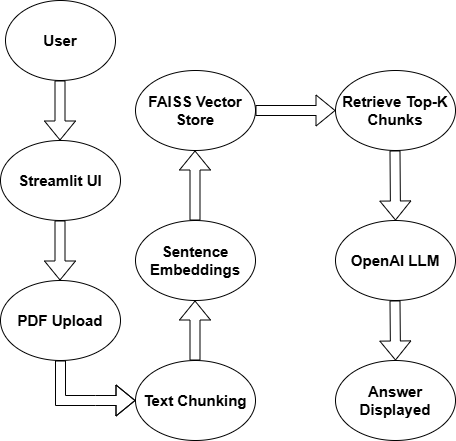
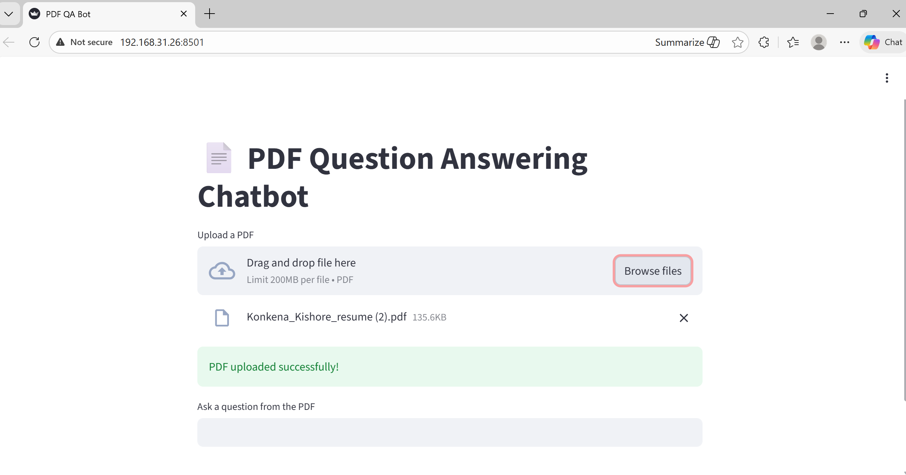

# 📄 PDF Question Answering Chatbot (RAG + Streamlit)

An interactive Retrieval-Augmented Generation (RAG) system for PDF-based question answering.
---

## 🏗 Architecture

The system follows a Retrieval-Augmented Generation (RAG) pipeline:

## 🔧 Tech Stack

- **Python**
- **SentenceTransformers** (Embeddings)
- **FAISS** (Vector Similarity Search)
- **OpenAI GPT** (LLM)
- **Streamlit** (Frontend UI)
- **RAG Architecture**

---

## 🚀 Features

- 📂 Real-time PDF upload
- ✂️ Semantic text chunking
- 🔎 Vector similarity search (FAISS)
- 🧠 Context-grounded LLM responses
- 💬 Interactive Streamlit interface

## 📸 Application Screenshots

### 📂 Upload PDF

### 💬 Generated Answer

## ▶️ Run Locally

pip install -r requirements.txt

## Create .env:

OPENAI_API_KEY=your_key_here

## Run CLI:

python app.py

## Run Streamlit:

python -m streamlit run streamlit_app.py

## 👨‍💻 Author

Kishore

